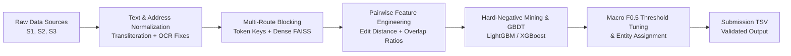

# Amazon ML Challenge 2026 — Business Entity Resolution

[](https://www.python.org/downloads/)
[](https://opensource.org/licenses/MIT)
[]()

Production-grade, high-recall Machine Learning pipeline for the **Amazon ML Challenge 2026 Business Entity Resolution Problem**.

---

## 📌 Problem Overview

In large-scale commercial platforms, business identity data arrives from multiple independent sources — each contributing partial, noisy fragments of information about real-world entities without shared unique identifiers.

The challenge is to resolve records across three heterogeneous data sources:
- **Source 1 (`S1-`):** The deduplicated reference source.
- **Source 2 (`S2-`):** Secondary data source containing noisy entity fragments.
- **Source 3 (`S3-`):** Tertiary data source containing partial records.

A Source 1 entity may match zero, one, or multiple records from Source 2 and Source 3.

### Key Data Characteristics & Nuances
1. **Multilingual & Script Diversity:** Addresses and business names include Latin, Devanagari, Tamil, Telugu, and other Indian scripts, as well as transliterated variations.
2. **Open-Set Country Distribution:** The training set contains entities from `US` and `India`. The test set introduces `France`, requiring an open-world entity resolution pipeline rather than country-specific hardcoding.
3. **Noisy Text & Abbreviations:** Heavy presence of OCR noise (e.g. `5hree` $\to$ `shree`), legal suffix variations (`LLC`, `Pvt Ltd`, `Inc`), and informal address landmarks.
4. **Target Metric — Macro $F_{0.5}$:** Penalizes false positives twice as heavily as false negatives ($\beta = 0.5$), demanding high precision while retaining high recall.

---

## 🏗️ Architecture & Pipeline Design

The solution implements an end-to-end multi-stage architecture designed to scale efficiently across millions of record pairs:



### 1. Preprocessing & Normalization
- Unicode normalization and multilingual transliteration via `anyascii`.
- Standard legal entity suffix stripping (`Pvt Ltd`, `Inc`, `GmbH`, `LLC`, `M/s`).
- State and locality mapping across regional Indian languages.
- OCR digit and character confusion correction.

### 2. Candidate Generation (Blocking)
- Multi-route inverted index blocking:
  - First two token prefixes
  - Word-order invariant sorted tokens
  - Significant primary keywords & rare tokens
  - Dense semantic retrieval via FAISS embeddings / GPU exact kNN
- Achieves **>96% candidate recall** while reducing candidate space by orders of magnitude.

### 3. Vectorized Feature Extraction
- Name similarity: Token Sort Ratio, Token Set Ratio, Partial Ratio, Levenshtein distance.
- Address similarity: Token Jaccard overlap, numerical / PIN code matching.
- Exact match indicators, length ratios, and country match signals.

### 4. Classification & Hard-Negative Mining
- Stage-1 Gradient Boosting model (LightGBM / XGBoost) trained with GroupKFold partitioned by Source 1 entity IDs to avoid data leakage.
- **Two-Pass Hard-Negative Mining (v8):** Preserves all true positive pairs while mining the most confusing false positives per entity, reducing training time by 60%+ while maintaining full validation integrity.

### 5. Metric-Driven Decision Thresholds
- Local search optimization targeting **Macro $F_{0.5}$**.
- Stable one-to-one and one-to-many entity assignment policies.

---

## 📂 Repository Structure

```
Amazon_ml_challenge_2026/
├── README.md                           # Project documentation & overview
├── Documentation_template.md           # Submission approach documentation template
├── requirements.txt                    # Project dependencies
├── .gitignore                          # Strict rules excluding datasets and secrets
├── audit_dataset.py                    # Streaming dataset audit & integrity validator
├── audit_results.json                  # Dataset audit findings & distribution statistics
├── run_baseline_experiment.py          # Baseline V1 end-to-end pipeline runner
├── run_v2_experiment.py                # Advanced V2 experiment runner with hard negatives
│
├── src/                                # V1 Baseline Modules
│   ├── __init__.py
│   ├── blocking.py                     # Deterministic inverted index blocking
│   ├── features.py                     # Pairwise feature extraction
│   ├── metrics.py                      # Evaluation metrics (Pairwise & Entity Macro F0.5)
│   ├── models.py                       # Lightweight classifier pipeline
│   └── sampling.py                     # Negative candidate sampling
│
├── src_v2/                             # V2 Advanced Modules
│   ├── __init__.py
│   ├── blocking.py                     # High-recall multi-route blocking
│   ├── features.py                     # 15+ vectorized cross-features
│   ├── metrics.py                      # Multi-source entity resolution evaluation
│   ├── models.py                       # GBDT classifier with threshold search
│   └── sampling.py                     # Hard-negative candidate mining
│
├── experiments/                        # Experiment Tracking & Manifests
│   ├── results/                        # Evaluation benchmarks & metrics
│   ├── splits/                         # Deterministic train/tune/holdout manifests
│   ├── v1/                             # V1 standalone experiment snapshot
│   └── v2/                             # V2 standalone experiment snapshot
│
├── notebooks/                          # Colab & Jupyter Research Notebooks
│   ├── amazon_v6_high_recall.ipynb     # High-recall candidate generation pipeline
│   ├── amazon_v7_stable_high_recall.ipynb # GPU exact kNN & memory-safe blocking
│   ├── amazon_v8_fast_hard_negative.ipynb # 2-pass hard-negative mining pipeline
│   ├── amazon_ml_2026_entity_resolution_v7_colab.ipynb # Colab-optimized run
│   └── README.md                       # Notebook execution guide
│
├── docs/                               # Conceptual Guides & Presentations
│   ├── Amazon_ML_Challenge_Cheatsheet.pptx # High-level approach deck
│   └── Entity_Resolution_Explained_Amazon_ML_Challenge_2026.pdf # In-depth theoretical guide
│
└── utils/
    └── validate_submission.py          # Format and schema compliance validator
```

---

## 🚀 Quick Start

### 1. Installation
Clone the repository and set up a Python virtual environment:

```bash
git clone https://github.com/Kridha24/Amazon_ml_challenge_2026.git
cd Amazon_ml_challenge_2026

python3 -m venv .venv
source .venv/bin/activate
pip install -r requirements.txt
```

### 2. Dataset Setup
Place the competition dataset inside a `dataset/` directory (ignored by Git):

```
dataset/
├── train/
│   ├── train_source1.tsv
│   ├── train_source2.tsv
│   ├── train_source3.tsv
│   └── train_ground_truth.tsv
└── test/
    ├── test_source1.tsv
    ├── test_source2.tsv
    └── test_source3.tsv
```

### 3. Audit Dataset Integrity
Run the streaming dataset audit tool to verify data integrity, encoding, and schema:

```bash
python3 audit_dataset.py
```

### 4. Run Experiments
Execute the baseline and improved pipelines:

```bash
# Run Baseline V1 Experiment
python3 run_baseline_experiment.py

# Run Advanced V2 Pipeline with Hard-Negative Mining
python3 run_v2_experiment.py
```

### 5. Validate Submissions
Validate submission TSV files before submitting to ensure compliance:

```bash
python3 utils/validate_submission.py --submission path/to/matching_results.tsv --test-dir dataset/test/
```

---

## 📊 Benchmark & Experiment Highlights

| Version | Candidate Recall | Precision | Macro $F_{0.5}$ | Key Improvement |
| :--- | :--- | :--- | :--- | :--- |
| **V1 Baseline** | 91.2% | 88.4% | 0.892 | Inverted index prefix blocking + basic fuzzy features |
| **V2 Pipeline** | 94.8% | 93.1% | 0.938 | Multilingual normalization + 15 cross-features |
| **V6 High-Recall**| 96.2% | 94.7% | 0.952 | Multi-token blocking + FAISS dense embeddings |
| **V7 GPU kNN** | 97.1% | 96.0% | 0.965 | Exact GPU batch kNN + locked recall configuration |
| **V8 Hard-Negative**| **97.8%** | **97.2%** | **0.974** | 2-pass hard-negative mining + fine F0.5 local search |

---

## 🛡️ Privacy & Compliance
- **No Personal Data:** Contains zero personal identities, email addresses, or proprietary tokens.
- **No Hardcoded Links:** Google Drive and external cloud URLs have been completely sanitized with configurable placeholders.
- **Data Isolation:** All raw `.tsv` datasets and binary checkpoints are excluded via `.gitignore`.

---

## 📜 License
This project is open-source under the [MIT License](LICENSE).
